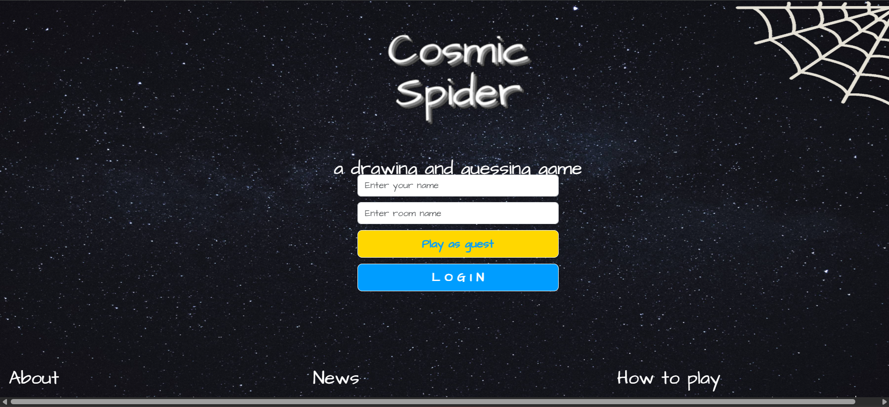
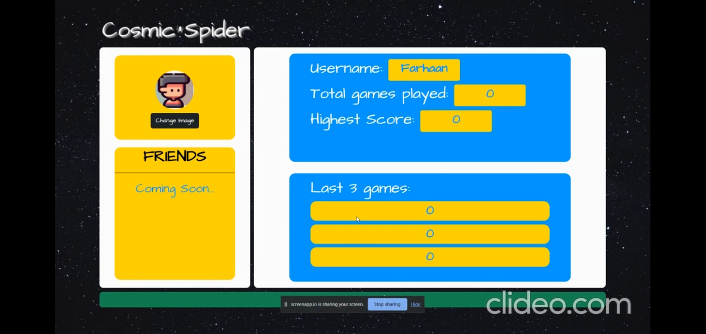
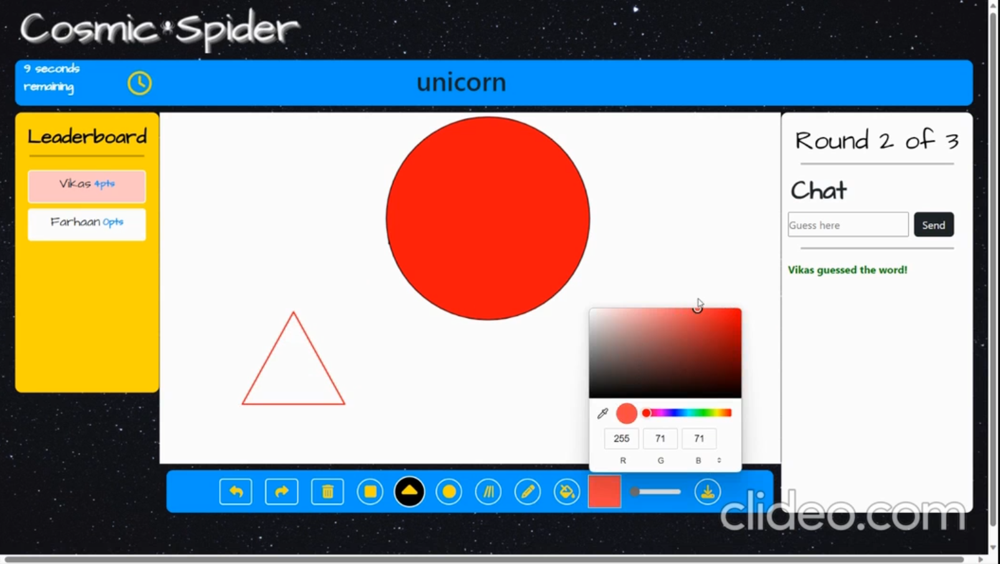
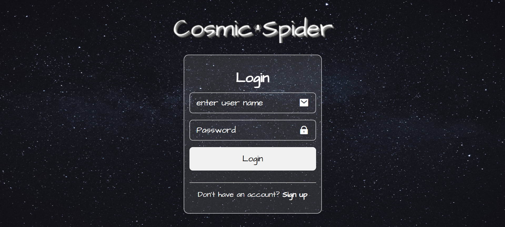

# 🕷️ Cosmic Spider

**Cosmic Spider** is a real-time multiplayer drawing and guessing game where players join game rooms, take turns drawing randomly assigned words, and compete by guessing correctly within a limited time.

The project combines real-time communication, multiplayer game state synchronization, interactive drawing, chat, scoring, player profiles, and persistent game statistics.

## 🚀 Live Demo

👉 **[Play Cosmic Spider](https://cosmic-spider.onrender.com/)**

---

## 📸 Screenshots

### 🏠 Home



### 👤 Player Profile



### 🎨 Multiplayer Drawing & Guessing



### 🔐 Login



---

## 🎮 How the Game Works

1. Enter a username and create or join a game room.
2. Players connected to the same room participate in the game.
3. During each turn, one player receives a secret word.
4. The selected player draws the word using the drawing canvas.
5. Other players try to guess the word through the chat.
6. Correct guesses are synchronized with all players in the room.
7. Players receive points based on their guesses and timing.
8. Multiple rounds are played before the final results are displayed.
9. Player statistics are updated after completed games.

---

## ✨ Features

### 🎨 Real-Time Drawing

- Interactive drawing canvas for the active player
- Multiple drawing tools and shapes
- Freehand drawing
- Lines, rectangles, circles, and triangles
- Fill and erase functionality
- Adjustable drawing controls
- Undo and redo support
- Clear canvas functionality
- Drawing actions synchronized with other players in real time

### 👥 Multiplayer Game Rooms

- Create or join game rooms
- Room-based multiplayer gameplay
- Players joining or leaving a room are synchronized
- Socket.IO rooms isolate game events between matches

### 💡 Word-Based Gameplay

- Random words are selected for each round
- The active player receives the secret word
- Other players receive a masked representation
- Turn management determines which player draws
- Multiple rounds can be played in a single game

### 💬 Real-Time Chat & Guessing

- Players submit guesses through the in-game chat
- Guesses are broadcast to players in the same room
- Correct guesses are detected in real time
- Guess timing is used as part of the scoring flow

### 🏆 Scoring & Leaderboard

- Players receive points for successful guesses
- Scores are maintained throughout the game
- Live leaderboard displays player rankings
- Final results show game performance

### ⏱️ Timed Rounds

- Each round has a time limit
- Remaining time is displayed during gameplay
- Guess timing is tracked for scoring

### 👤 Player Profiles

Registered players have persistent profiles containing:

- Username
- Profile image
- Total games played
- Highest score
- Recent game scores
- Recent game positions

### 🔐 Authentication

- User registration and login
- Password hashing using bcrypt
- Session-based authentication
- Guest gameplay support

### 📊 Persistent Game Statistics

Game results are stored and used to update player profiles.

The application tracks:

- Total games played
- Highest score
- Recent game scores
- Recent positions

---

## ⚡ Real-Time Architecture

Cosmic Spider uses **Socket.IO** to synchronize multiplayer game state between the server and connected players.

```text
                         ┌─────────────────────┐
                         │    Player Browser   │
                         │                     │
                         │ Drawing Canvas      │
                         │ Chat / Guessing     │
                         │ Game Controls       │
                         └──────────┬──────────┘
                                    │
                              Socket.IO
                                    │
                         ┌──────────▼──────────┐
                         │   Node.js Server    │
                         │     + Express       │
                         │                     │
                         │ Room Management     │
                         │ Turn Management     │
                         │ Word Selection      │
                         │ Scoring             │
                         │ Game State          │
                         └──────────┬──────────┘
                                    │
                              Socket.IO Rooms
                                    │
                   ┌────────────────┴────────────────┐
                   │                                 │
            ┌──────▼──────┐                   ┌──────▼──────┐
            │  Player 1   │                   │  Player 2   │
            │   Drawing   │                   │   Guessing  │
            └─────────────┘                   └─────────────┘
                                    │
                                    ▼
                            ┌───────────────┐
                            │   MongoDB     │
                            │               │
                            │ Users         │
                            │ Profiles      │
                            │ Game Stats    │
                            └───────────────┘
````

---

## 🔄 Real-Time Game Flow

```text
Player joins room
       │
       ▼
Socket.IO room created/joined
       │
       ▼
Players connected
       │
       ▼
Select active player
       │
       ▼
Generate random word
       │
       ├──────────────► Active player receives word
       │
       └──────────────► Other players receive masked word
                              │
                              ▼
                         Drawing begins
                              │
                              ▼
                  Drawing events broadcast
                              │
                              ▼
                     Players submit guesses
                              │
                              ▼
                    Correct guess detected
                              │
                              ▼
                       Score calculated
                              │
                              ▼
                         Round ends
                              │
                              ▼
                       Next round
                              │
                              ▼
                       Final results
                              │
                              ▼
                    Profile statistics updated
```

---

## 🛠️ Tech Stack

### Frontend

* HTML5
* CSS3
* JavaScript
* HTML Canvas API

### Backend

* Node.js
* Express.js
* Socket.IO

### Database

* MongoDB
* Mongoose

### Authentication

* Express Session
* bcrypt.js

### Deployment

* Render

---

## 🗄️ Database

Cosmic Spider uses **MongoDB** with Mongoose for persistent user and profile information.

The application stores authentication information and player statistics.

### User Information

* Username
* Email
* Hashed password
* Online status

### Player Profile

* Username
* Profile image
* Total games played
* Highest score
* Recent game scores
* Recent game positions

Game completion events update the corresponding player statistics.

---

## 🔐 Authentication Flow

```text
                 ┌───────────────┐
                 │     User      │
                 └───────┬───────┘
                         │
                Login / Signup
                         │
                         ▼
                 ┌───────────────┐
                 │   Express     │
                 │   Server      │
                 └───────┬───────┘
                         │
                  bcrypt hashing
                         │
                         ▼
                 ┌───────────────┐
                 │    MongoDB    │
                 └───────┬───────┘
                         │
                         ▼
                 Session created
                         │
                         ▼
                 Authenticated User
```

---

## 🎨 Drawing System

The game includes an interactive canvas-based drawing system.

Players can use different drawing operations including:

* Freehand drawing
* Lines
* Rectangles
* Circles
* Triangles
* Fill
* Eraser
* Clear canvas
* Undo
* Redo

Drawing events are transmitted through Socket.IO so players in the same room can see the drawing in real time.

---

## 🏆 Scoring System

During a round, the server tracks players who correctly guess the word and records their guess timing.

Scores are synchronized with the room leaderboard.

```text
Correct Guess
      │
      ▼
Guess Timing Recorded
      │
      ▼
Score Calculated
      │
      ▼
Leaderboard Updated
      │
      ▼
Final Ranking
```

After a game, the player's profile statistics are updated with the new game result.

---

## 📁 Project Structure

```text
Cosmic_Spider/
│
├── HTML/
│   ├── index.html
│   ├── login.html
│   ├── gamepage.html
│   └── ...
│
├── CSS/
│   ├── index-style.css
│   ├── gamepage-style.css
│   └── ...
│
├── JavaScript/
│   ├── main.js
│   ├── index.js
│   ├── gamepage.js
│   └── ...
│
├── media/
│   ├── cosmic-home.png
│   ├── cosmic-profile.png
│   ├── cosmic-game.png
│   ├── cosmic-login.png
│   └── ...
│
├── app.js
├── mongodb.js
├── package.json
├── package-lock.json
├── Procfile
└── README.md
```

---

## ⚙️ Local Development

### Prerequisites

Make sure you have:

* Node.js
* npm
* MongoDB
* MongoDB connection string

### 1. Clone the Repository

```bash
git clone https://github.com/VIKAS-cybercode/Cosmic_Spider.git
cd Cosmic_Spider
```

### 2. Install Dependencies

```bash
npm install
```

### 3. Configure MongoDB

Configure the MongoDB connection according to the settings used by `mongodb.js`.

### 4. Start the Server

```bash
node app.js
```

The application will start on the configured server port.

---

## 🌐 Deployment

Cosmic Spider is deployed using **Render**.

### Live Application

👉 **[Play Cosmic Spider](https://cosmic-spider.onrender.com/)**

---

## 🤝 Collaboration

Cosmic Spider was developed as a **collaborative project**.

The project combines:

* Real-time multiplayer communication
* Room management
* Interactive drawing
* Game logic
* Authentication
* Database persistence
* Player statistics
* Scoring and leaderboards

---

## 🔮 Future Improvements

* Private room invitations
* More drawing tools
* Custom game categories
* Improved matchmaking
* Better mobile responsiveness
* Spectator mode
* Enhanced player rankings
* More detailed game analytics
* Persistent global leaderboard

---

## ⭐ Explore Cosmic Spider

Play the game and experience real-time multiplayer drawing and guessing.

👉 **[🕷️ Play Cosmic Spider](https://cosmic-spider.onrender.com/)**

👉 **[💻 GitHub Repository](https://github.com/VIKAS-cybercode/Cosmic_Spider)**

